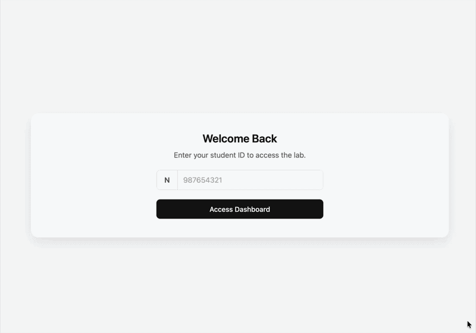

# Lab Booking System

A resource reservation system that allows students to book lab hardware remotely. Constructed for **SUNY New Paltz SWE Class '26**.
###### Note: The focus of this project is to showcase my backend capabilities utilizing the Spring Framework. As a result, the frontend dashboard serves as a demo client and a visualization tool for the REST API and thus was not created by me.

  

